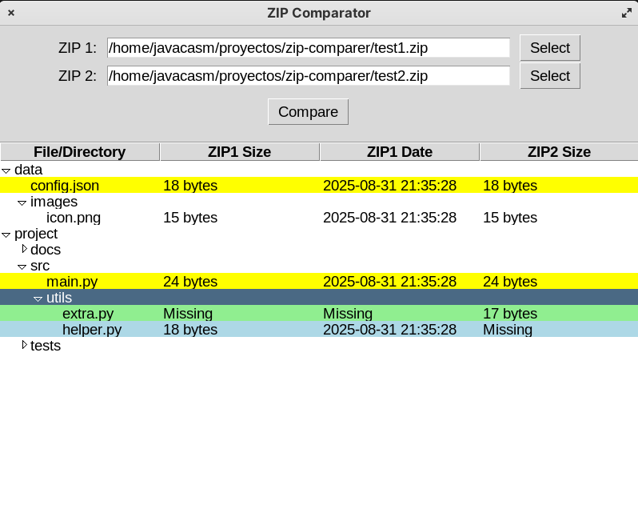
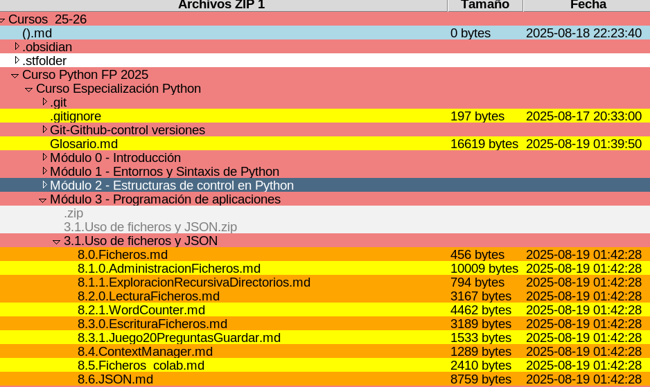
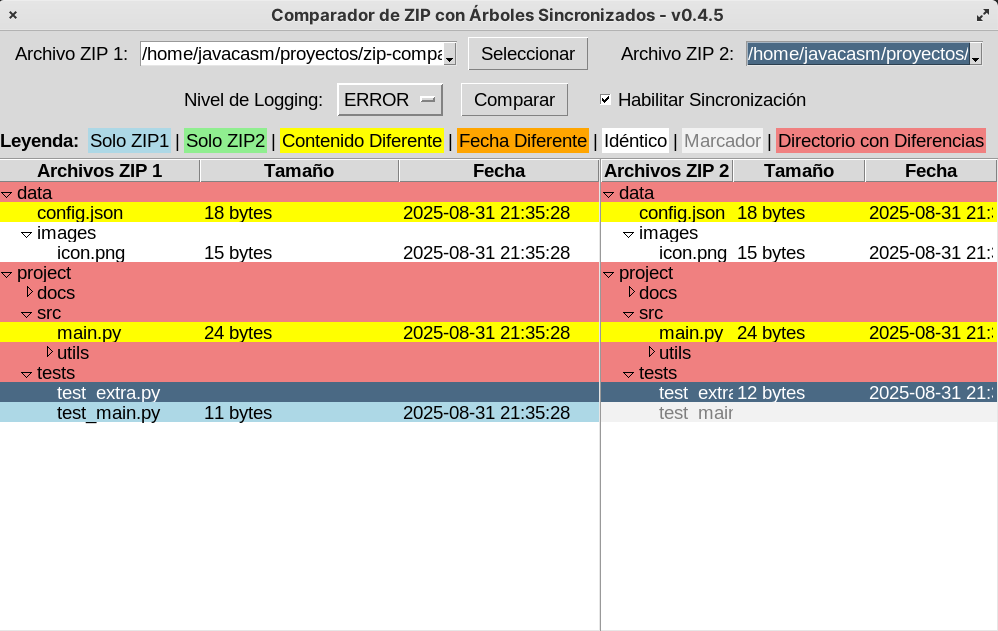

# Comparador de ficheros Zips

Vamos a realizar un proyecto completo, incluyendo su diseño, código, pruebas y tests automáticos

Se trata de un comparador de archivos ZIPs, que nos mostraré visualmente las diferencias entre dos ficheros.

Usaremos [Grok](https://grok.com/share/bGVnYWN5_34d4e29c-5e6d-43c2-a3e7-5a22c8700074) como ayuda para la generación de código.

Implementaremos un sistema de versiones con 3 números:

* El primero indica la versión principal (será 0 en estas primeras frases hasta que tengamos una aplicación funcional).
* El segundo irá indicando los cambios de funcionalidad.
* El tercero, si existe, indicará corrección de errores.

He creado un[ repositorio github con el contenido](https://github.com/javacasm/CompZIPAS). En lugar de hacer versiones sobre el código, que sería lo habitual, he preferido mantener todos los ficheros con nombres que incluyen la versión para ver el proceso de creación del código.

Para subir el contenido del proyecto a github, he hecho lo siguiente, en la carpeta del proyecto:

* He inicializado un repositorio git con `git init`.
* He añadido los ficheros a git con `git add fichero`.
* Excluimos algunos fichero del sistema de versiones incluyéndolos en el fichero `.gitignore`
```
codigo/test1.zip
codigo/test2.zip
codigo/recent_zips.txt
.gitignore
```
* Hacemos un commit de los ficheros con `git commit -m "v0.1"`
* Creamos la rama "main" (principal) con `git branch -M main`
* Enlazamos con el repositorio remotor de github con `git remote add origin git@github.com:javacasm/CompZIPAS.git`
* Publicamos los cambios con `git push -u origin main`


## v0.0

Vamos a empezar viendo si existen herramientas similares en el mercado y si adecuan a nuestras necesidades.

```prompt
Tengo 2 ficheros zip del mismo directorio de momentos distintos, con miles de ficheros dentro, y quiero saber las diferencias entre ambos ¿hay alguna herramienta para hacerlo?
```

Sí, hay varias herramientas que pueden ayudarte a comparar las diferencias entre dos archivos ZIP, especialmente cuando contienen miles de ficheros. Dependiendo de tu sistema operativo y preferencias (GUI o línea de comandos), aquí te detallo algunas opciones recomendadas. La mayoría requieren extraer los archivos temporalmente para una comparación detallada, pero algunas pueden manejar ZIP directamente.

### Opciones GUI (Interfaz Gráfica)
- **[Beyond Compare](https://www.scootersoftware.com/)**   : Una herramienta potente y popular para comparar carpetas, archivos y archivos ZIP directamente. Puede expandir los ZIP sin extraerlos permanentemente y mostrar diferencias en contenido, nombres de archivos, tamaños y más. Es ideal para grandes volúmenes de datos. Disponible para Windows, macOS y Linux (versión de prueba gratuita, luego de pago).
- **[WinMerge](https://winmerge.org/?lang=es)** : Gratuita y de código abierto, excelente para comparar carpetas. Extrae los ZIP a directorios temporales y compara recursivamente. Muestra diferencias visuales de manera clara. Principalmente para Windows, pero hay ports para otros SO.
- **[ExCompare](https://www.easexp.com/excompare/)** : Diseñada específicamente para comparar carpetas y archivos como ZIP, RAR o 7Z. Muestra diferencias en una interfaz simple y es gratuita para uso básico.

### Opciones de Línea de Comandos (CLI)
- **zipcmp** : Una utilidad específica para comparar archivos ZIP sin extraerlos. Identifica diferencias en contenido, metadatos y estructura. Disponible en Linux (instálala con paquetes como `zipcmp` en repositorios), y es rápida para grandes archivos.
- **diff** (con unzip) : En Unix/Linux/macOS, extrae ambos ZIP a directorios temporales con `unzip archivo1.zip -d dir1` y `unzip archivo2.zip -d dir2`, luego usa `diff -r dir1 dir2` para una comparación recursiva. Para Windows, puedes usar Git Bash o WSL.
- **ZipDiff** (de .NET) : Una herramienta de código abierto en GitHub que compara ZIP directamente y soporta varios formatos de salida (como JSON). Requiere .NET instalado.

### Opciones con Programación
- **Python con módulo zipfile** : Si prefieres un script personalizado, puedes usar Python para listar y comparar el contenido de los ZIP sin extraer todo. Por ejemplo, un script simple que chequea hashes de archivos para detectar cambios.

Para grandes cantidades de ficheros, elige herramientas que eviten extraer todo si es posible (como Beyond Compare o zipcmp) para ahorrar tiempo y espacio. 

---

El resultado es bueno, encontrando las opciones más recomendadas, salvo una aplicación online, [zipcomparetool](https://zipcomparetool.com/) 


Que en nuestro caso no nos sirve porque son ficheros demasiado grandes para subirlos online, además de las connotaciones de falta de privacidad de subir ficheros a una web... 

Tras ver que las opciones gratuitas WinMerge y exCompare son para Windows, nos decantamos por crear una aplicación.
## v0.1

Vamos a comenzar a generar el código

```prompt
Crea código para una aplicación visual en python para que compare dos ficheros zip. 

Muestra en la ventana 2 componentes lado a lado con el nombre de los ficheros, su tamaño y fecha, mostrando de distintos colores si son distintos, pudiendo navegar recursivamente los ficheros
```



El resultado es una aplicación operativa y que cumple su función. Es un buen punto de partida para ir añadiendo opciones y adecuada para aprender.

[Código v0.1](https://raw.githubusercontent.com/javacasm/CompZIPAS/refs/heads/main/codigo/zip-comparer_v0_1.py)

## v0.2

Vamos a mejorar la visualización, activando la sincronización de movimientos en los dos árboles de ficheros. También añadiremos log de mensajes y le pediremos que cree ficheros zip para probar.

```prompt
Vamos a crear una visualización con 2 árboles, colocados visualmente uno al lado del otro. 

Al movernos por uno se moverá el otro, manteiendo los ficheros alineados, si un fichero sólo está en uno de los ficheros en el arbol asociado al otro fichero se verá una línea en blanco.

Añade trazas usando logging y la consola, pudiendo configurar el nivel de log que se envía a la consola, a medida que se va recuperando información de los ficheros.
Genera 2 ficheros zip de prueba para probar la funcionalidad
```



El resultado está bastante bien, aunque con errores... en la parte de sincronización de la selección en los árboles.


[Código v0.2](https://raw.githubusercontent.com/javacasm/CompZIPAS/refs/heads/main/codigo/zip-comparer_v0_2.py)
# v0.3

Viendo que el proceso va  a ser algo más largo (por los errores de sincronización) proponemos que se use numeración de versión, unos ficheros más complejos para probar y algunos cambios en el interfaz gráfico.

- Etiqueta cada versión con un número, la próxima será la 0.3.0, cambiando el segundo número con funcionalidad nueva y el tercero para corrección de errores
- Incluye un comentario al principio del código indicado la versión
- Genera ficheros zip de prueba más complejos    
- Marca los directorios con colores diferentes cuando contienen diferencias y sin color cuando son iguales    
- Muestra la leyenda de colores y su significado
- Pon los controles de los selectores de ficheros en una misma línea, cada uno encima de su tree


Siguen los errores de sincronización, pero ya tiene bastante buen aspecto.

[Código v0.3.1](https://raw.githubusercontent.com/javacasm/CompZIPAS/refs/heads/main/codigo/zip-comparer_v0_3_1.py)
## v0.4

Tras 6 versiones...  se solucionan los problemas de sincronización
```prompts

- No funciona la sincronización entre los dos treeviews, pero al menos no hay bucle infinito. Crea una variable en el código para activar/desactivar la sincronización
- Traduce al castellano los comentarios y las etiquetas
- Utiliza un color de texto diferente (gris claro) para los elementos no que no están en uno de los zips
- Guarda los ficheros recientes usados anteriormente y cambia el selector de finchero por un combo con los anteriores zips usados
- Corrección: muestras los textos de la leyenda con su correspondiente color background  
...

- Ya funciona la sinconización, falta que al desplegar un directorio en uno se despliegue el equivalente en el otro

- No guardes en la lista de recientes los ficheros utilizados repetidos

...

Aunque se establezca como nivel de log ERROR, se siguen mostrando por consola los mensajes de DEBUG ¿no deberían de mostrarse sólo lode nivel error y critical?

...

Vamos a mover las trazas sobre el número de archivos de los zip y el nymero de miembros únicos al nivel Info,
```



Después de todas estas versiones, vemos que una única funcionalidad, no esencial nos ha provocado la mayoría de los errores...

[Código v0.4.5](https://raw.githubusercontent.com/javacasm/CompZIPAS/refs/heads/main/codigo/zip-comparer_v0_4_5.py)
## v0.5 - Future

Dejamos aquí una lista de los cambios previstos para futuras versiones:

* Seleccionar comparación por fechas, tamaño, contenido (se marcan como activas o no en la leyenda)
* Detalles de cada uno de los zips: tamaño, fecha, número de ficheros ¿algo más?
* ¿Cachear la información de los zips?
* Tamaño de las columnas ajustado al contenido
* Menú contextual con:
	* Visores de diferencias:
		* Texto (txt, md)
		* Imágenes
	* Mostrar información de los directorios: número de ficheros/directorios ¿tamaño? ¿fecha?  
	* Desplegar todo el árbol
## Test automáticos

Vamos a generar ahora una colección de tests para verificar el funcionamiento y que nos va a permitir asegurarnos que al añadir nueva funcionalidad todo sigue funcionando.

### Test automáticos con `unittest`

Para crear una batería de tests automáticos para el proyecto "Comparador de ZIP con Árboles Sincronizados" (versión 0.4.6), utilizaré el módulo `unittest` de Python. Los tests verificarán las funcionalidades clave del programa, incluyendo la comparación de ZIPs, la sincronización de árboles, la gestión de archivos recientes, y el comportamiento del logging. Dado que el programa utiliza `tkinter` para la interfaz gráfica, los tests se centrarán en la lógica subyacente (funciones como `compare`, `select_zip`, `load_recent_zips`, `save_recent_zips`, etc.) y simularán interacciones donde sea necesario, evitando pruebas directas de la GUI debido a su complejidad.

### Estrategia de Tests

1. **Funcionalidades a Probar**:
   - **Carga y guardado de archivos recientes** (`load_recent_zips`, `save_recent_zips`):
     - Verificar que se cargan correctamente los ZIPs recientes desde `recent_zips.txt`.
     - Asegurar que no se guardan duplicados y que se respeta el límite de 5 entradas.
   - **Selección de ZIPs** (`select_zip`):
     - Comprobar que los archivos seleccionados se añaden o reordenan sin duplicados en la lista de recientes.
   - **Comparación de ZIPs** (`compare`):
     - Validar que los árboles muestran correctamente archivos idénticos, diferentes, exclusivos, y marcadores.
     - Verificar el etiquetado de directorios con diferencias (`dir_diff`).
     - Comprobar el mapeo de nodos (`node_map`) para sincronización.
   - **Sincronización de árboles** (`sync_selection`, `sync_open`):
     - Simular eventos de selección y expansión para verificar la sincronización.
   - **Creación de ZIPs de prueba** (`create_test_zips_if_not_exist`):
     - Asegurar que se crean correctamente los ZIPs de prueba con la estructura esperada.
   - **Logging**:
     - Verificar que los mensajes de nivel `INFO` (número de archivos y miembros únicos) y `ERROR` se emiten correctamente.

2. **Consideraciones**:
   - Usaré `unittest.mock` para simular la interfaz gráfica (`tkinter`) y el diálogo de selección de archivos (`filedialog`).
   - Crear archivos ZIP temporales para pruebas, limpiándolos después.
   - Simular un entorno `tkinter` mínimo para probar la lógica de los árboles (`Treeview`).
   - Mantendré la traducción al castellano en los mensajes de error y comentarios.

3. **Estructura**:
   - Un solo archivo `test_zip_comparator.py` con clases de tests organizadas por funcionalidad.
   - Cada test será independiente, con setup y teardown para evitar efectos secundarios.

[Código de los Tests con unittest](https://raw.githubusercontent.com/javacasm/CompZIPAS/refs/heads/main/codigo/test_zip_comparer_unittest.py)

### Detalles de los Tests

1. **Configuración y Limpieza**:
   - **setUp**: Crea un directorio temporal para archivos ZIP de prueba, inicializa un entorno `tkinter` mínimo (dos `Treeview`), configura etiquetas de color y limpia las listas globales (`RECENT_ZIPS_1`, `RECENT_ZIPS_2`, `node_map`).
   - **tearDown**: Destruye el entorno `tkinter` y elimina el directorio temporal.

2. **Tests Implementados**:
   - **`test_load_recent_zips`**: Verifica que `load_recent_zips` carga correctamente un archivo `recent_zips.txt` simulado.
   - **`test_load_recent_zips_empty`**: Comprueba que las listas están vacías si `recent_zips.txt` no existe.
   - **`test_save_recent_zips`**: Asegura que `save_recent_zips` guarda correctamente las listas de ZIPs recientes.
   - **`test_select_zip_no_duplicates`**: Prueba que `select_zip` no crea duplicados en la lista de recientes.
   - **`test_select_zip_max_recent`**: Verifica que `select_zip` respeta el límite de `MAX_RECENT` (5 elementos).
   - **`test_compare_identical_zips`**: Comprueba que `compare` etiqueta correctamente archivos idénticos como `same` y actualiza `node_map`.
   - **`test_compare_different_zips`**: Valida que `compare` detecta diferencias (`content_diff`, `only_zip1`, `only_zip2`, `placeholder`).
   - **`test_compare_directory_differences`**: Asegura que los directorios con diferencias se etiquetan como `dir_diff`.
   - **`test_create_test_zips`**: Verifica que `create_test_zips_if_not_exist` crea ZIPs con 7 archivos cada uno.
   - **`test_compare_empty_selection`**: Comprueba que `compare` muestra un error si no se seleccionan ZIPs.
   - **`test_logging_info_messages`**: Valida que los mensajes de nivel `INFO` (número de archivos y miembros únicos) se emiten correctamente.

3. **Dependencias**:
   - Usa módulos estándar: `unittest`, `os`, `zipfile`, `logging`, `tkinter`, `datetime`, `sys`, `tempfile`, `shutil`.
   - Usa `unittest.mock` para simular `filedialog` y `os.path.abspath`.

4. **Ejecución**:
   - Guarda el archivo como `test_zip_comparator.py` en el mismo directorio que `zip_comparator.py`.
   - Asegúrate de que `zip_comparator.py` (versión 0.4.6) esté disponible.
   - Ejecuta los tests con:
     ```bash
     python -m unittest test_zip_comparator.py
     ```

5. **Salida Esperada**:
   - Si todos los tests pasan, verás algo como:
     ```
     ...........
     ----------------------------------------------------------------------
     Ran 11 tests in 0.123s
     OK
     ```
   - Si algún test falla, se mostrará el mensaje de error correspondiente (en castellano, por ejemplo, "Error al cargar ZIP1 recientes").

### Notas

- **Limitaciones**:
  - Los tests no cubren directamente la interacción con la GUI (`tkinter`), ya que probar interfaces gráficas requiere herramientas como `tkinter.testing` o `PyAutoGUI`, que no son estándar.
  - Las funciones `sync_selection` y `sync_open` no se probaron exhaustivamente debido a la dificultad de simular eventos `<<TreeviewSelect>>` y `<<TreeviewOpen>>` sin un framework específico.

- **Posibles Mejoras en los Tests**:
  - Añadir tests para `sync_selection` y `sync_open` usando un framework como `tkinter.testing`.
  - Probar casos límite, como ZIPs vacíos o con miles de archivos.
  - Simular errores de E/S (por ejemplo, permisos denegados al leer ZIPs).
  - Añadir tests para verificar el formato de las fechas en los `Treeview`.

- **Integración con el Proyecto**:
  - Coloca `test_zip_comparator.py` en el directorio del proyecto.
  
Los tests verifican la carga/guardado de archivos recientes, comparación de ZIPs, sincronización, creación de ZIPs de prueba y logging.

### Test automáticos con `pytest`

Para crear una batería de tests automáticos para el proyecto "Comparador de ZIP con Árboles Sincronizados" (versión 0.4.6) usando `pytest`, desarrollaré un conjunto de pruebas que cubran las mismas funcionalidades clave que en la batería anterior con `unittest`, pero aprovechando las características de `pytest` como fixtures, parametrización y un estilo más conciso. Los tests verificarán la lógica subyacente del programa (funciones como `compare`, `select_zip`, `load_recent_zips`, `save_recent_zips`, etc.), evitando pruebas directas de la interfaz gráfica (`tkinter`) debido a su complejidad.

### Estrategia de Tests

1. **Funcionalidades a Probar**:
   - **Carga y guardado de archivos recientes** (`load_recent_zips`, `save_recent_zips`):
     - Verificar carga correcta desde `recent_zips.txt`.
     - Asegurar que no haya duplicados y se respete el límite de 5 entradas.
   - **Selección de ZIPs** (`select_zip`):
     - Comprobar que los archivos seleccionados se añaden o reordenan sin duplicados.
   - **Comparación de ZIPs** (`compare`):
     - Validar etiquetado de archivos idénticos, diferentes, exclusivos y marcadores.
     - Verificar etiquetado de directorios con diferencias (`dir_diff`).
     - Comprobar el mapeo de nodos (`node_map`).
   - **Creación de ZIPs de prueba** (`create_test_zips_if_not_exist`):
     - Asegurar que se crean ZIPs con la estructura esperada.
   - **Logging**:
     - Verificar mensajes de nivel `INFO` (número de archivos y miembros únicos).

2. **Consideraciones**:
   - Usaré fixtures de `pytest` para configurar el entorno (directorio temporal, árboles `Treeview`, etc.).
   - Usaré `unittest.mock` para simular `tkinter` y `filedialog`.
   - Crear ZIPs temporales para pruebas, limpiándolos después.
   - Mantendré la traducción al castellano en mensajes y comentarios.
   - No probaré directamente `sync_selection` ni `sync_open` debido a la dificultad de simular eventos `tkinter`.

3. **Estructura**:
   - Un archivo `test_zip_comparator_pytest.py` con funciones de test organizadas por funcionalidad.
   - Fixtures para reutilizar configuración (directorio temporal, árboles, etc.).
   - Uso de parametrización para casos variados.

[Código de los Tests con pytest](https://raw.githubusercontent.com/javacasm/CompZIPAS/refs/heads/main/codigo/test_zip_comparer_pytest.py)

### Detalles de los Tests

1. **Fixtures**:
   - **`temp_dir`**: Crea un directorio temporal para archivos ZIP de prueba y lo elimina al finalizar.
   - **`tk_env`**: Configura un entorno `tkinter` con dos `Treeview` y etiquetas de color.
   - **`clean_globals`**: Limpia las variables globales (`RECENT_ZIPS_1`, `RECENT_ZIPS_2`, `node_map`) antes y después de cada test.
   - **`create_zip`**: Proporciona una función para crear ZIPs de prueba en el directorio temporal.

2. **Tests Implementados**:
   - **`test_load_recent_zips`**: Verifica la carga de `recent_zips.txt`.
   - **`test_load_recent_zips_empty`**: Comprueba que las listas están vacías si el archivo no existe.
   - **`test_save_recent_zips`**: Asegura que los ZIPs recientes se guardan correctamente.
   - **`test_select_zip_no_duplicates`**: Prueba que no se crean duplicados en la lista de recientes.
   - **`test_select_zip_max_recent`**: Verifica que se respeta el límite de `MAX_RECENT` (5).
   - **`test_compare_identical_zips`**: Valida el etiquetado de archivos idénticos (`same`) y el mapeo de nodos.
   - **`test_compare_different_zips`**: Comprueba el etiquetado de diferencias (`content_diff`, `only_zip1`, `only_zip2`, `placeholder`).
   - **`test_compare_directory_differences`**: Asegura que los directorios con diferencias se etiquetan como `dir_diff`.
   - **`test_create_test_zips`**: Verifica la creación de `test1.zip` y `test2.zip` con 7 archivos cada uno.
   - **`test_compare_empty_selection`**: Comprueba el error por selección vacía.
   - **`test_logging_info_messages`**: Valida los mensajes de nivel `INFO` usando el fixture `caplog` de `pytest`.

3. **Dependencias**:
   - Módulos estándar: `pytest`, `os`, `zipfile`, `logging`, `tkinter`, `datetime`, `sys`, `tempfile`, `shutil`.
   - `unittest.mock` para simular `filedialog` y `os.path.abspath`.
   - `pytest` debe estar instalado:
     ```bash
     pip install pytest
     ```

4. **Ejecución**:
   - Guarda el archivo como `test_zip_comparator_pytest.py` en el mismo directorio que `zip_comparator.py`.
   - Asegúrate de que `zip_comparator.py` (versión 0.4.6) esté disponible.
   - Ejecuta los tests con:
     ```bash
     pytest test_zip_comparator_pytest.py -v
     ```
   - La opción `-v` muestra detalles de los tests ejecutados.

5. **Salida Esperada**:
   - Si todos los tests pasan, verás algo como:
     ```
     ============================= test session starts =============================
     test_zip_comparator_pytest.py::test_load_recent_zips PASSED              [ 10%]
     test_zip_comparator_pytest.py::test_load_recent_zips_empty PASSED        [ 20%]
     test_zip_comparator_pytest.py::test_save_recent_zips PASSED              [ 30%]
     test_zip_comparator_pytest.py::test_select_zip_no_duplicates PASSED      [ 40%]
     test_zip_comparator_pytest.py::test_select_zip_max_recent PASSED         [ 50%]
     test_zip_comparator_pytest.py::test_compare_identical_zips PASSED        [ 60%]
     test_zip_comparator_pytest.py::test_compare_different_zips PASSED        [ 70%]
     test_zip_comparator_pytest.py::test_compare_directory_differences PASSED [ 80%]
     test_zip_comparator_pytest.py::test_create_test_zips PASSED              [ 90%]
     test_zip_comparator_pytest.py::test_compare_empty_selection PASSED       [100%]
     test_zip_comparator_pytest.py::test_logging_info_messages PASSED         [100%]
     =========================== 11 passed in 0.12s ===========================
     ```
   - Si algún test falla, `pytest` mostrará el mensaje de error en castellano (por ejemplo, "Error al cargar ZIP1 recientes").

### Comparación con `unittest`

- **Ventajas de `pytest`**:
  - Código más conciso gracias a fixtures y funciones en lugar de clases.
  - Fixture `caplog` simplifica la captura de mensajes de logging.
  - Parametrización (no usada aquí, pero disponible para casos futuros).
  - Informes de salida más detallados y legibles.
- **Diferencias**:
  - Usa funciones en lugar de clases, lo que reduce la verbosidad.
  - Fixtures reemplazan `setUp` y `tearDown`, permitiendo reutilización modular.
  - `caplog` es más elegante que el manejador personalizado de `unittest`.

### Notas

- **Limitaciones**:
  - No se prueban `sync_selection` ni `sync_open` debido a la dificultad de simular eventos `tkinter`.
  - Los tests asumen que `zip_comparator.py` está en el mismo directorio y es la versión 0.4.6.
- **Posibles Mejoras**:
  - Añadir tests para eventos `tkinter` usando un framework como `pytest-tkinter`.
  - Parametrizar tests para cubrir más casos (por ejemplo, ZIPs vacíos o con estructuras anidadas complejas).
  - Probar errores de E/S (permisos, archivos corruptos).
  - Integrar con `pytest-cov` para medir la cobertura:
    ```bash
    pip install pytest-cov
    pytest --cov=zip_comparator test_zip_comparator_pytest.py
    ```
- **Integración con el Proyecto**:

Los tests verifican la carga/guardado de archivos recientes, comparación de ZIPs, creación de ZIPs de prueba y logging.
